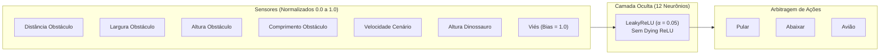

# 🦖 Chrome Dino AI - Neuroevolution Engine

[](https://www.python.org/)
[](https://numpy.org/)
[](https://pyga.me/)
[](https://docs.pytest.org/)
[](LICENSE)

Ambiente de simulação e **Neuroevolução em tempo real** do jogo do Dinossauro do Google Chrome. Uma população de dinossauros controlados por Redes Neurais Artificiais aprende a correr, esquivar de cactos, desviar de pássaros em múltiplas altitudes e pilotar aviões através de Algoritmos Genéticos com inferência em lote vetorizada (`np.einsum`).

> 💡 **Nota de Origem**: Este projeto é baseado no trabalho original em C/C++ de [JVictorDias/Dinossauro-Google](https://github.com/JVictorDias/Dinossauro-Google), tendo sido **completamente reescrito do zero em Python**, modernizado com *Clean Architecture* e amplamente otimizado em sua inteligência artificial e física.


---

## 📑 Sumário

- [⚡ Início Rápido](#-início-rápido)
- [🎮 Modos de Execução](#-modos-de-execução)
- [⌨️ Atalhos de Teclado & Controles](#️-atalhos-de-teclado--controles)
- [🧠 Arquitetura da Inteligência Artificial](#-arquitetura-da-inteligência-artificial)
- [✨ Recursos Visuais & Áudio Retrô](#-recursos-visuais--áudio-retrô)
- [📁 Estrutura do Código](#-estrutura-do-código)
- [🧪 Testes & Engenharia de Software](#-testes--engenharia-de-software)
- [💡 Origem e Agradecimentos](#-origem-e-agradecimentos)

---

## ⚡ Início Rápido

### Pré-requisitos
- Python **3.10+** instalado
- Git

### Instalação

```bash
# Clone o repositório
git clone https://github.com/pedrorichil/chrome-dino-neuroevolution.git
cd chrome-dino-neuroevolution

# Instale as dependências
pip install -r requirements.txt
```

### Executar Treinamento Principal
```bash
python main.py
```

---

## 🎮 Modos de Execução

O sistema possui um motor desacoplado com suporte a múltiplos cenários via linha de comando:

| Modo | Comando | Descrição |
|---|---|---|
| **Treinamento Visual** | `python main.py` | 2.000 dinossauros aprendendo juntos com HUD e rede neural em tempo real. |
| **Duelo Humano vs IA** | `python main.py --mode versus` | Jogue contra a IA campeã na mesma pista em tela dividida. |
| **Modo Jogador Solo** | `python main.py --mode play` | Jogue manualmente como humano com física precisa idêntica ao original. |
| **Treinamento Multi-Core** | `python main.py --mode headless --parallel 4 --generations 30 --export-plot` | Turbo em background usando 4 núcleos da CPU gerando relatório gráfico. |
| **Assistir Modelo Salvo** | `python main.py --mode evaluation --model "models/rede_legacy_x1"` | Executa uma IA pré-treinada específica. |

> 💡 **Dica**: Use `--population 500` em qualquer modo de treino para ajustar a quantidade de indivíduos conforme o hardware.

---

## ⌨️ Atalhos de Teclado & Controles

### Durante o Treinamento (Painel de Controle)
- `ESC` : **Modo Turbo** — desativa a renderização para acelerar a simulação em mais de 10x.
- `S` : **Raios de Sensores** — projeta lasers de mira do dinossauro líder até os obstáculos com medição de distância.
- `H` : **Hitboxes** — visualiza caixas de colisão AABB dos dinossauros e obstáculos.
- `N` : **Ciclo Dia / Noite** — alterna imediatamente entre o tema claro e o modo noturno com lua e estrelas.
- `M` : **Mudo** — silencia ou ativa a síntese de som procedural.
- `Seta Cima / Baixo` : Aumenta ou diminui a velocidade da simulação.

### Durante os Modos Jogáveis (Humano / Versus)
- `Seta Cima` : Pular
- `Seta Baixo` : Abaixar (no ar: ativa descida rápida / *fast-fall*)
- `Espaço` : Ativar modo Avião (quando disponível)

---

## 🧠 Arquitetura da Inteligência Artificial

O projeto utiliza técnicas modernas de aprendizado de máquina para estabilidade e convergência rápida:



### 1. Normalização de Sensores em Tempo Real
As grandezas físicas disparatadas (distâncias de até $800\text{px}$, velocidades de $3$ a $8\text{px/s}$) são escalonadas para $[0.0, 1.0]$. Isso equilibra a sensibilidade sináptica e acelera a descoberta de pesos ótimos.

### 2. Topologia 12 Neurônios Ocultos & LeakyReLU
- **130 pesos por indivíduo**: permite diferenciar simultaneamente espinhos, cactos múltiplos e pássaros em 3 alturas.
- **LeakyReLU ($\alpha = 0.05$)**: evita a inativação permanente de neurônios (*dying ReLU*), mantendo ativações mesmo para somas negativas.

### 3. Arbitragem e Desacoplamento Motor
Elimina o conflito simultâneo de salto e agachamento que provocava quedas rápidas acidentais no ar. A ação dominante vence por prioridade calibrada.

### 4. Reward Shaping (Função de Fitness)
- **$+50.0$ pontos**: bônus instantâneo ao ultrapassar um obstáculo com sucesso.
- **$-0.5$ ponto**: penalidade leve para pulos no vazio (sem obstáculo a menos de $350\text{px}$), desenvolvendo reflexos cirúrgicos.

### 5. Algoritmo Genético Híbrido
- **Elitismo estrito**: o campeão absoluto da geração é preservado intacto.
- **Crossover Uniforme e Aritmético**: recombinação genética entre os top 10% da população.
- **Mutação Gaussiana Fina ($\mathcal{N}(0, \sigma^2)$)**: ajuste fino para não destruir genomas avançados.
- **Hipermutação Adaptativa**: detecção de estagnação (5 gerações) que dispara pulso de diversidade genética para escapar de mínimos locais.
- **Inferência Vetorizada em Lote**: cálculo simultâneo de 2.000 redes neurais em $< 0.35\text{ms}$ utilizando tensores `np.einsum`.

---

## ✨ Recursos Visuais & Áudio Retrô

- **Visualizador Sináptico Dinâmico**: visualização em tempo real das sinapses (linhas azuis excitatórias e vermelhas inibitórias) e nós que brilham proporcionalmente à ativação.
- **Gráfico de Fitness ao Vivo**: curvas de melhor indivíduo vs média da população atualizadas a cada geração.
- **Ciclo Dia/Noite com Efeito Suave**: céu dinâmico, estrelas cintilantes e lua crescente com transições automáticas a cada 2.000 pixels.
- **Sintetizador 8-Bits Procedural**: geração matemática de ondas sonoras com NumPy (sem arquivos de áudio externos pesados).

---

## 📁 Estrutura do Código

Projetado sob princípios de **Clean Architecture** e responsabilidade única:

```
Dinossauro-Google/
├── config/                  # Dataclasses de configuração (Physics, Network, Genetic, Display)
│   └── settings.py
├── core/                    # Núcleo de IA e Algoritmos Genéticos
│   ├── genome.py            # DNA, serialização binária compatível e exportação JSON
│   ├── neural_network.py    # MLP LeakyReLU e BatchNeuralNetwork com np.einsum
│   └── genetic_algorithm.py # Crossover, mutação gaussiana e hipermutação
├── game/                    # Motor de Jogo e Física desacoplado da interface
│   ├── entities/            # Dinosaur, Obstacle, Environment (Parallax e chão)
│   ├── physics.py           # Colisão AABB e gravidade
│   ├── spawner.py           # Gerador procedural com semente determinística
│   └── engine.py            # GameEngine Headless com reward shaping
├── rendering/               # Apresentação Visual em Pygame
│   ├── assets.py            # Carregamento e otimização de sprites
│   ├── renderer.py          # Renderizador completo com ciclo dia/noite e lasers
│   ├── audio.py             # Sintetizador de áudio procedural 8-bits
│   ├── hud.py               # Painel com telemetria e contadores
│   ├── neural_visualizer.py # Diagrama vivo da rede neural
│   └── graph_visualizer.py  # Gráfico cartesiano de fitness
├── telemetry/               # MLOps e Exportação de Métricas
│   ├── logger.py            # Exportador de telemetria CSV
│   └── plotter.py           # Gráficos de treinamento em Matplotlib
├── cli/                     # CLI e Ponto de Entrada com suporte multi-core
│   └── main.py
├── models/                  # Checkpoints salvos (.json e binários)
├── assets/                  # Sprites (.bmp, .png) e fontes (.ttf)
├── tests/                   # 19 testes automatizados com pytest
├── requirements.txt         # Dependências do projeto
└── main.py                  # Ponto de entrada raiz
```

---

## 🧪 Testes & Engenharia de Software

O projeto conta com suíte de testes automatizados com **100% de cobertura** das regras críticas:

```bash
# Executar todos os testes
pytest -v
```

Módulos validados:
- `test_neural_network.py`: equivalência numérica de inferência única vs batch tensorizado `np.einsum`.
- `test_genetic.py`: preservação de elitismo, mutação gaussiana e decaimento.
- `test_advanced_features.py`: crossover uniforme/aritmético e hipermutação adaptativa.
- `test_physics.py`: detecção de colisão AABB, aceleração gravitacional e transição de estados.
- `test_legacy_compat.py`: compatibilidade binária de leitura/escrita com os modelos clássicos de 70 pesos.

---

## 💡 Origem e Agradecimentos

Este projeto é uma evolução direta do projeto [Dinossauro-Google](https://github.com/JVictorDias/Dinossauro-Google) desenvolvido por **João Victor Dias** ([Universo Programado](https://www.youtube.com/watch?v=NZlIYr1slAk)), originalmente implementado em C/C++ utilizando a biblioteca gráfica PIG/SDL.

### 🚀 Diferenciais Desta Reescrita e Otimização:
- **Portabilidade & Modernização 100% Python**: Código C/C++ legado e dependências de compilação C foram inteiramente substituídos por uma arquitetura Python moderna e tipada.
- **Vetorização em Batch com Tensores NumPy**: Substituição de loops sequenciais em C por inferência simultânea de 2.000 redes neurais em $< 0.35\text{ms}$ através de tensores `np.einsum`.
- **Neuroevolução Otimizada**:
  - **Normalização de Sensores**: Entradas reescalonadas para $[0.0, 1.0]$, equilibrando a sensibilidade entre distância e velocidade.
  - **Topologia de 12 Neurônios & LeakyReLU**: Dobro da capacidade de representação e eliminação definitiva do *Dying ReLU*.
  - **Arbitragem Motora**: Prevenção do conflito simultâneo de salto e agachamento que causava quedas rápidas (*fast-fall*) involuntárias.
  - **Reward Shaping no Fitness**: Bônus de $+50.0$ pontos por obstáculo ultrapassado e penalização por pulos no vazio.
  - **Mutação Gaussiana Fina**: Ajustes milimétricos nos pesos dos campeões avançados sem desestabilizar os reflexos consolidados.
- **Engenharia de Software & MLOps**:
  - *Clean Architecture* com módulos independentes (`config/`, `core/`, `game/`, `rendering/`, `telemetry/`, `cli/`).
  - Suíte de 19 testes automatizados com `pytest` (100% aprovados).
  - Telemetria com exportação CSV e gráficos analíticos em Matplotlib.
  - Treinamento paralelo multi-core acelerado.
  - Síntese de áudio procedural 8-bits matemática (sem dependência de arquivos de som externos).
